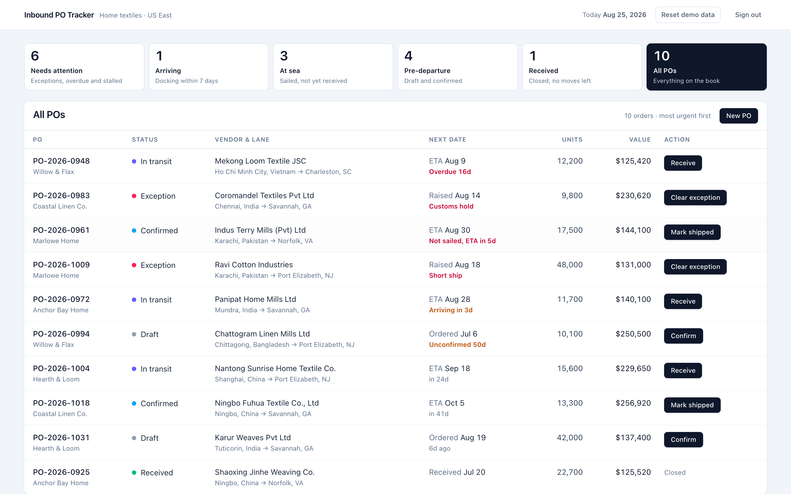

# Inbound PO Tracker

Inbound purchase orders for a home textiles importer goods manufactured in Asia,
shipped by sea to a US East Coast DC. The client is an operations coordinator and their daily workflow relies on this dashboard. 



```bash
npm install
npm run dev            # http://localhost:3000
npm run build && npx playwright test
```

Sign in with `ops@savannah.example` / `inbound`. There is no user store, so that
is the only account there is.

## What the UI is optimized for

The job is moving POs through states and observing preexisting states. 

- **The list is filtered by triage.** Rows sort by urgency. Exceptions
  and overdue containers first, closed POs last.
- **Status has a visual indicator.** A tinted dot per row, coupled
  with a colored text for urgency.
- **The timeline shows where the PO is, not just what it has.** Milestones behind
  the PO are emerald and joined by a solid rail.
- **Transitions fire from the row.** Each row carries its one legal next move
  (`Confirm`, `Mark shipped`, `Receive`, `Clear exception`).
- **Blocked moves are shown with their reason.** For example, `PO-2026-0961` is five
  days from its booked ETA and never sailed and its detail page renders a disabled
  `Receive` state.

## Architecture

**Five form client components**
[components/transition-form.tsx](components/transition-form.tsx),
[create-form.tsx](app/purchase-orders/new/create-form.tsx),
[edit-form.tsx](app/purchase-orders/%5BpoNumber%5D/edit/edit-form.tsx),
[delete-form.tsx](app/purchase-orders/%5BpoNumber%5D/edit/delete-form.tsx) and
[login-form.tsx](app/login/login-form.tsx).
Every mutation is a form posting to a server action. Each one is a client
component for the same two reasons: `useActionState` reads the pending state,
and the action returns its error as a value that has to render.
[app/error.tsx](app/error.tsx) ] React
error boundaries catch during render and hold state, so the framework requires
it to be a client component.

**Editing and the status machine own disjoint fields.** No input on the edit
form writes `status`, `confirmedOn`, `shippedOn` or `receivedOn`


**The timeline reads off the head of the track, not off each step.** The status
maps to one index in the five milestones, and done/current/projected fall out of
the comparison.

**The button paints the status the transition lands on, and the server can still
say no.** Clicking `Receive` reads `-> Received` immediately; `guard()` runs
server-side regardless, and a refused move renders its reason under the button
while the label snaps back. 


That optimism is read from `useFormStatus` in a
child component rather than from `useOptimistic`.

**Every form still posts with JavaScript disabled.** 

**There is deliberately no `app/loading.tsx`.** A root `loading.tsx` puts the
page behind a Suspense boundary, so Next streams the real content inside
`<div hidden>` and swaps it in with a script.
cost and is present.

**Routes are dynamic because the data is mutable.**
No page carries `force-dynamic`. `/` reads `searchParams`, and
`/purchase-orders/[poNumber]` has no `generateStaticParams`. The one place the
export does appear is the JSON route below, where it is pinning a default rather
than changing one.

## The JSON export

`GET /api/purchase-orders` returns `{ today, purchaseOrders }` from the live store, `no-store`.

- **Could not be middleware.** The Edge sandbox is a separate V8 context, so importing `lib/store.ts` there compiles a second array from the seed and serves it forever. Measured: renderer says `received`, middleware still says `in_transit`.
- **Gated by its own session check**, the only one left since the matcher narrowed. Anonymous `curl` gets `401`.
- **`force-dynamic` pins a default**; `revalidate` or `generateStaticParams` would freeze the seed into the build.

**Filtering is a URL search param** The view tiles are `<Link>`s and the list re-renders on the server.

**The state machine is one module.** [lib/status.ts](lib/status.ts) owns the
transitions, the guards and the labels. 
`guard()` answers reconciles the UI and server action.

**Nothing derived is stored.** "Overdue", "arriving", "unconfirmed 50d" and order
value are computed in [lib/derived.ts](lib/derived.ts). 

**Dates are formatted with a hard-coded locale and UTC.** ISO calendar strings
are parsed as UTC midnight and rendered through a pinned `Intl` formatter, so the
server and the browser produce the same string and React reports no hydration
mismatch.

### Layout

```
app/            routes, layout, server actions
components/     ui components shared by both routes
data/           handcrafted synthetic seed
lib/            business logic: state machine, date helpers, derived state, in-memory store
e2e/            one Playwright spec file
```

## Persistence

[lib/store.ts](lib/store.ts) holds a module-level deep copy of the seed, mutated
by the server action. It lives as long as the Node process and resets on restart.
No database, no ORM, no file writes. The copy hangs off `globalThis` so the dev
server's hot reload does not silently discard it mid-session.

A PO raised in the app lives in that same copy, so it survives navigation and
disappears on reset or restart along with every other mutation.

"Reset demo data" in the header restores the seed. It is a real feature of a demo
whose state is in memory, and it is also the hook the Playwright fixture uses, so
repeat local runs are deterministic without a test-only back door.

## Auth
[lib/session.ts](lib/session.ts) signs and verifies an HS256 JWT on Web Crypto
and **imports nothing**.


**Reading is public. Changing the book is private.** 
**The gate is two halves, and the second one is the real one.**
[middleware.ts](middleware.ts) covers only the two routes that exist to mutate,
`/purchase-orders/new` and `/purchase-orders/[poNumber]/edit`. That is a courtesy
for humans following a stale link. The boundary is the session check inside every
mutation in [app/actions.ts](app/actions.ts), and it has to be: a server action
POSTs to whatever URL the page is already on, and those URLs are now public. Next
also forwards an action id the current page does not own to whichever page does,
so there is no route-shaped place to stand.

The actions return that as a value rather than redirecting, because a 307
preserves the method: redirecting an expired submit would re-POST the form to
`/login` and lose whatever was typed into it, which is usually an exception note.

**What this is not.** The credential is a constant, the secret falls back to a
committed default when `AUTH_SECRET` is unset.


## Assumptions

Stated here rather than guessed silently:

- The list defaults to all POs that are sorted by urgency.
- **`Mark shipped` records only the ship date.** Vessel, container and a booked
  ETA come from the carrier, so the action does not invent them.
- **`Clear exception` returns the PO to `exception.raisedFrom` and drops the
  exception record.** No logging or long-term storage.
- **Raising an exception requires a note.** It is the only field the next person
  to open the PO actually needs, so the action rejects an empty one.
- **A received PO is never flagged.** PO-2026-0925 landed four days after its
  ETA. 
- **Light theme only.**
- **No webfont.** The brief rules out dependencies, and a `next/font/google` face
  would make `next build` in CI depend on a third-party host and reintroduce the
  layout shift this app otherwise has none of.
- **A new PO is always a `draft`,** with every downstream date null. `draft` is
  the state machine's entry edge, so the create form has no status field.
- **The PO number is typed in, not generated.** It is the ERP's identity and it
  doubles as the route segment.
- **Editing is scoped by status.** A draft exposes the vendor, brand, ports,
  order date and each line's quantity and cost. Anything `confirmed`,
  `in_transit` or `exception` exposes only the carrier's booking, ETA, vessel,
  container.
- **A form carries the scope it was built from.** If the PO moves between render
  and submit, the action refuses the whole submit rather than saving.
- **Only a draft can be deleted.** Nothing outside the app depends on a draft.

## Testing

One spec, [e2e/purchase-orders.spec.ts](e2e/purchase-orders.spec.ts), with two
tests. The primary path: load the list, open PO-2026-0948 (in transit, 16 days
overdue), receive it, assert the status renders as `Received` on the detail page
and on the list behind it. The CRUD round trip: raise a draft, edit a commercial
field, a line quantity and the ETA in one save, confirm a confirmed PO offers no
delete, then delete the draft and confirm the row is gone.

Both assert on rendered content and contain no timeouts. They share one fixture,
which now signs in before it resets — going to `/` signed out lands on `/login`
via middleware, so the redirect is exercised by every run rather than by a third
test. Still one spec, still two tests.

## CI

[.github/workflows/ci.yml](.github/workflows/ci.yml) runs on push and pull
request: install, `tsc --noEmit`, `next lint`, `next build`, then the spec.
Deployment is out of scope.

## Approximate Time Spent 
~2.5 hours including agentic review loop.
